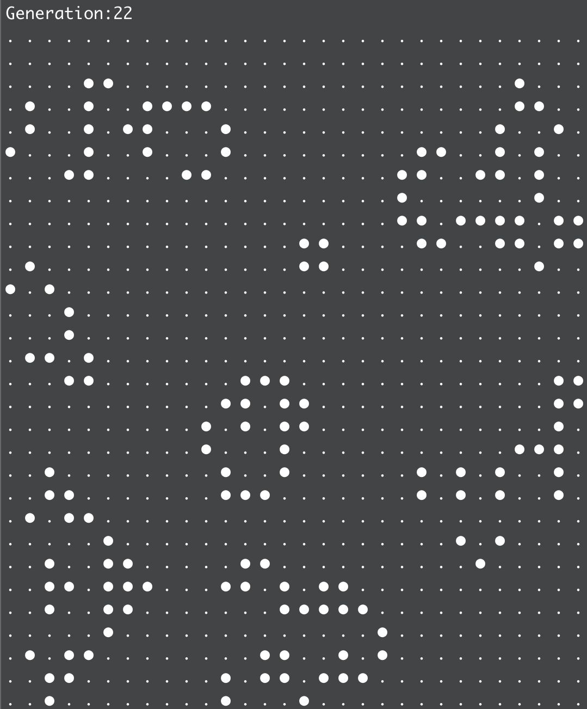

# GoLife
### Conway's Game of Life
</img>

### Run
> install go
> go run .

#### Design specs
* 2D grid of square cells in a 1D array
* cells have two states - dead or alive
* cells interact with their surrouding neighbours - horizontally, vertically and diagonally - for every world tick 

#### Game rules
* any live cell with 2 or 3 live neighbours lives
* any dead cell with 3 live neighbours becomes a live cell
* all other live cells dies and dead cells stay dead

### Next
- Build this in Haskell
